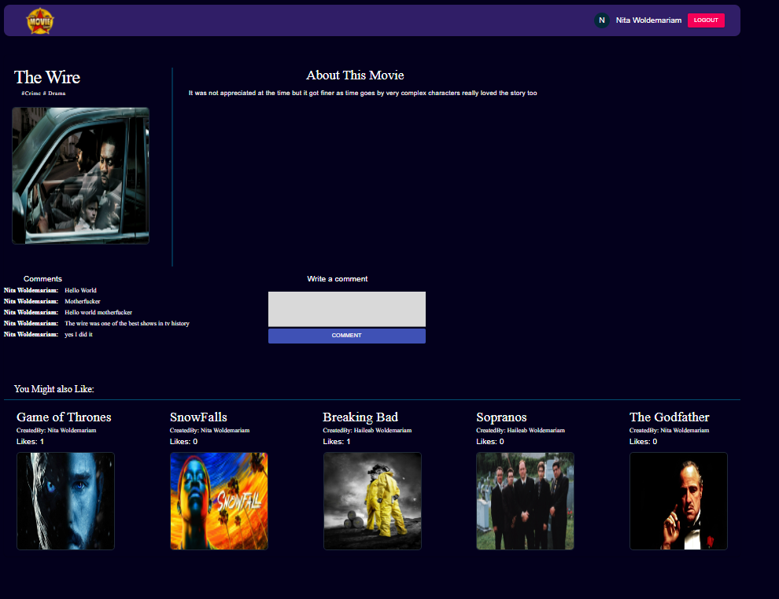

<h1 style="font-family: 'Montserrat'; font-size: 32px; font-weight: bold; color: #333; margin-bottom: 20px;">Movie Store Application</h1>

 This is a movie store application built using the MERN stack (MongoDB, Express.js, React.js, and Node.js). It allows users to create, update, delete, and read movie posts, as well as post their own critiques. Each movie has a dedicated detail page that provides comprehensive information about the movie. ## Features- User Authentication: Users can create accounts, log in, and log out securely. This ensures that only authenticated users can access and modify the movie posts and critiques.- Movie CRUD: Users can perform basic CRUD operations on movie posts. They can create new movie posts, update existing ones, delete unwanted posts, and view all the movies available.- Movie Detail Page: Each movie has its own detail page that provides detailed information about the movie such as the title, genre, release date, director, and cast. Users can also view and post critiques specific to that movie.- Critiques: Users can read critiques posted by others for each movie. They can also post their own critiques, sharing their thoughts and opinions about the movie.## ScreenshotsHere are some screenshots of the Movie Store application:

